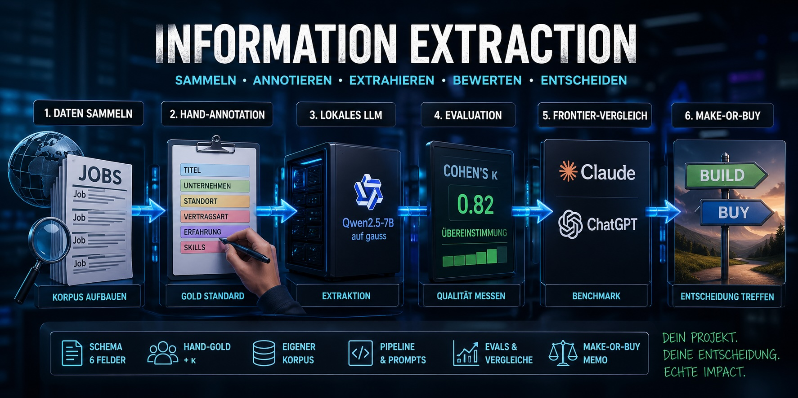

  

# LS Information Extraction — Hauptprojekt

Diese Lernsituation baut eine **Pipeline zur strukturierten Informations-Extraktion** aus Stellenanzeigen — vom Daten-Sammeln über Hand-Annotation, eigene Cohen's-κ-Auswertung und ein eigenes lokales Sprachmodell (Qwen2.5-7B auf gauss) bis zum Frontier-LLM-Vergleich (Claude / ChatGPT) und einer Make-or-Buy-Entscheidung.

## Loslegen

Voraussetzung: ihr habt die zwei vorgelagerten Mini-LS durchgearbeitet —

- **BERT/Transformers-Mini-LS** (extern): <https://berndheidemann.github.io/transformer-transfer-learning/>
- **Mini-LS Information Extraction** (Schema, Cohen's κ, Prompt-Patterns): <https://berndheidemann.github.io/ls-information-extraction/>

Wenn nicht — sprecht den Lehrer an, *bevor* ihr Phase 1 startet.

1. Repo geklont — siehe `CHEATSHEETS/git-grundlagen.md`, falls noch nicht passiert. SSH geht im Schulnetz nicht, Clone läuft über HTTPS + Personal Access Token.
2. **Phasen der Reihe nach** durcharbeiten — siehe `AUFGABEN/`. Reihenfolge ist nicht beliebig: Phase 2 braucht den Korpus aus Phase 1, Phase 3 das Hand-Gold aus Phase 2, usw.
3. **Bewertungs-Kriterien einmal vorab gelesen** — `BEWERTUNG/kriterien.md`. Nicht erst am Bewertungstag.

## Verzeichnis-Übersicht

| Pfad | Inhalt |
|---|---|
| `AUFGABEN/` | 6 Aufgabenblätter, eines pro Phase — *was zu tun ist* |
| `notebooks/` | leere Notebook-Vorlagen mit Run-Header — euer Hauptarbeitsplatz |
| `CHEATSHEETS/` | Werkzeug-Referenzen (κ, Pipeline, Git, GPU, JSONL, Frontier-Workflow) |
| `BEWERTUNG/kriterien.md` | wie bewertet wird — drei Bereiche × vier Stufen |
| `SCHEMA.md` | das fixe 6-Felder-Schema, gegen das ihr annotiert + extrahiert |
| `annotation/` | CSV-Templates + `validate.py` (Schema-Check + κ-Tool) |
| `daten/` | hier landet euer eigener Korpus aus Phase 1 |

## Zeitbudget

18 h Präsenz Hauptprojekt + ~10 min Einzel-Fachgespräch zum Abschluss (~1 h Klassenzeit für alle sechs zusammen).

## Wenn ihr stuck seid

Lehrer ansprechen. Es gibt keinen Punktabzug für gezielte Hilfe — aber zuerst selbst recherchieren oder den passenden Cheatsheet konsultieren. Pro Phase steht im Aufgabenblatt eine Faustregel (typischerweise *„nach 90 min stuck → Lehrer fragen"*).

## Was am Ende auf GitHub stehen soll

Beim Fachgespräch öffnet der Lehrer euer Repo. Erwartete Inhalte (vollständige Liste in `CHEATSHEETS/git-grundlagen.md`):

- Vier ausgefüllte Notebooks (`01_explore`, `02_extract`, `03_eval`, `04_frontier_compare`)
- Drei CSVs in `annotation/` (eigene + Partner-Hand-Gold + Frontier-Annotation)
- Euer Korpus in `daten/eigener_korpus.jsonl`
- Make-or-Buy-Memo aus Phase 5 (`memo_make_or_buy.md` im Repo-Root)
- Saubere Commit-History — nicht ein einziger Mega-Commit am letzten Tag
